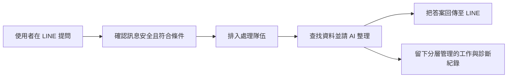

# AI-ChotBot 專案進度簡報

## 第 1 頁｜讓 LINE 成為跑步社群的即時 AI 助理

- 專案名稱：AI-ChotBot
- 一句話介紹：跑者在 LINE 提問，就能取得跑步訓練與天氣等整理後的答案
- 本次說明：成果、現況、風險與下一步

**講者備註：** 今天用約十五至二十分鐘，帶各位從跑步社群的需求出發，了解這個 LINE AI 助理已完成的能力、仍在開發的知識搜尋，以及正式上線前必須完成的驗證。

---

## 第 2 頁｜跑步社群目前面臨的問題

- 跑步訓練、裝備與活動資訊分散，跑者不知道該去哪裡找
- 天氣會影響訓練安排，需要快速取得即時資訊
- 社群中的重複問題仰賴人工回覆，速度與品質容易受忙碌程度影響
- 服務若離開 LINE，使用門檻就會提高

**講者備註：** 跑者真正需要的不是更多連結，而是能在熟悉的 LINE 社群中快速取得訓練與天氣重點。對社群管理者而言，也需要降低重複回答的負擔，同時維持一致品質。

---

## 第 3 頁｜我們提供的解決方案

- 以 LINE 作為入口，不必另外安裝新工具
- AI 將跑步問題整理成容易閱讀的回答
- 天氣資訊連接專門的外部資料來源
- 背景處理與安全檢查兼顧速度與穩定性

**講者備註：** 這套方案像一位設在 LINE 跑步社群裡的 AI 助理：先確認問題可安全處理，再依問題類型取得資訊或由模型整理回答，最後把答案送回原本的對話。

---

## 第 4 頁｜使用者實際操作情境

- 目前操作範圍僅限指定的 LINE 群組
- 使用者須以 LINE 原生提及功能點名機器人，系統才會處理
- 可詢問跑步訓練問題，或查詢會影響訓練安排的天氣
- 複雜問題在背景處理，不占住接待入口
- 知識搜尋是上線後的預期能力；正式環境操作仍待實機驗證

**講者備註：** 在指定群組中，跑者需用 LINE 內建的提及方式點名機器人，例如詢問週末訓練時段的天氣。現階段可說明的是開發環境中的處理能力；指定群組的正式環境收訊、回覆與知識搜尋，仍須依序完成實機驗證與後續上線。

---

## 第 5 頁｜系統如何運作

- 先做安全與條件檢查，再接受處理
- 排隊機制像取號碼牌，避免尖峰時塞車
- 回傳答案，並依用途分層管理工作與診斷紀錄
- Workers Logs 使用去識別化欄位且不寫入訊息原文；D1 工作紀錄會暫存問題與回答供處理與診斷，最長 30 天後清理

**講者備註：** 整體流程就像有秩序的服務櫃台：入口先確認來件，處理隊伍分散尖峰壓力，後台取得資訊並整理，再把結果送回。紀錄採分層管理：Workers Logs 不寫入訊息原文，D1 則為完成工作與診斷問題暫存問題及回答，並依最長 30 天的期限清理。

---

## 第 6 頁｜已完成的核心功能

- LINE 訊息接收、判斷與回覆流程
- 背景排隊處理，降低尖峰流量影響
- AI 回答與即時天氣資料整合
- 隱私友善的運作觀測與錯誤追蹤
- 已建立自動化測試、型別與部署檢查機制；本次上線前設定檢查仍待更新

**講者備註：** 正式主分支已具備從收訊、排隊、AI 整理到回覆的完整骨架，也完成天氣整合與分層紀錄方式。品質檢查機制已建立，但本次上線前的雲端設定檢查定義仍須更新，不能視為已通過部署驗證。

---

## 第 7 頁｜AI 如何產生可靠回答

- 天氣問題使用 Open-Meteo 專門資料來源
- 一般跑步問題目前由模型生成，尚未經專屬知識庫佐證
- 可附來源的知識檢索仍在開發中，尚非目前正式能力
- 異常時採保守回覆，避免誤導使用者

**講者備註：** 目前只有天氣問題有 Open-Meteo 提供的專門資料；一般跑步問題是由模型產生，仍可能出錯，也尚未由專屬知識庫提供佐證。後續的引用式知識檢索完成並上線後，才會讓指定知識問題附上可追溯來源。

---

## 第 8 頁｜知識庫搜尋功能進度

- 狀態：開發中，尚未合併至正式主線
- 目標：先從專屬資料找答案，再交由 AI 摘要
- 目前仍需完成程式整理、審查與合併前品質檢查
- 通過自動化驗證後，才會進入合併與部署

**講者備註：** 知識搜尋像替 AI 增加一座專屬圖書館，能優先使用指定內容回答。不過這部分仍在開發分支，尚未成為主分支能力；即使分支測試有結果，也還不能視為正式可用。

---

## 第 9 頁｜使用技術、目前狀態與帶來的價值

- 每項技術都有明確角色，不為技術而技術
- 雲端元件像分工團隊，各自處理專長工作
- 開發與測試工具降低改版時的人工作業風險

| 技術 | 目前狀態 | 白話角色與客戶價值 |
| --- | --- | --- |
| LINE Messaging API | 主線已具備 | LINE 與系統之間的收發櫃台，讓使用者留在熟悉的 LINE 完成提問與收答 |
| Cloudflare Workers | 主線已具備 | 就近服務使用者的雲端接待員，可快速接收請求且不必自建伺服器 |
| Queues | 主線已具備 | 尖峰時的取號碼牌系統，分散瞬間流量並降低漏單與塞車風險 |
| Workers AI | 主線已具備 | 雲端 AI 工作站，協助理解、整理並產生自然語言回答 |
| D1 | 主線已具備 | 結構化電子資料櫃；工作紀錄會暫存問題與回答供處理與診斷，最長 30 天後清理，也保存天氣快取等需要查詢的資料 |
| R2 | 知識搜尋開發中 | 大型檔案倉庫，規劃經濟地存放文件與知識來源檔案 |
| Vectorize | 知識搜尋開發中 | 依語意找資料的智慧索引，規劃找出意思相近的內容而不只比對關鍵字 |
| Open-Meteo | 主線已具備 | 即時氣象資料站，提供可查證的天氣資訊 |
| Tavily | 知識搜尋開發中 | 專為 AI 準備的網路搜尋助手，規劃協助取得較新、可整理的外部資訊 |
| Hono | 主線已具備 | 輕量的網路服務骨架，讓接收與回覆流程清楚、容易維護 |
| TypeScript | 主線已採用 | 會先檢查格式的工程圖，可提早發現資料與程式介面不一致 |
| Vitest | 主線已採用 | 自動巡檢員，可重複驗證既有功能沒有被改壞 |
| Wrangler | 主線已採用 | 雲端環境的部署遙控器，統一開發、設定、測試與發布流程 |

**講者備註：** 這些名稱看似繁多，其實是把收訊、排隊、儲存、搜尋、AI 與測試分工。表中已清楚區分主線能力與知識搜尋開發項目，避免把規劃中的元件誤認為已上線功能。

---

## 第 10 頁｜資料安全與隱私保護

- 入口先驗證訊息來源與必要條件
- Workers Logs 僅使用去識別化欄位，不寫入訊息原文
- D1 工作紀錄會暫存問題與回答供處理與診斷，最長 30 天後清理
- 敏感設定與程式、簡報內容分離
- 正式環境仍需再次核對權限與設定

**講者備註：** 資料最少化會依紀錄用途落實。Workers Logs 用去識別化欄位觀察運作狀況，不寫入訊息原文；D1 為完成背景工作及診斷問題，會暫存問題與回答，並在最長 30 天後清理。憑證及敏感設定不會放進程式碼或簡報。

---

## 第 11 頁｜系統穩定性與測試成果

- 測試註記：2026-07-30 開發環境自動化測試，非正式環境驗收
- 主分支預設測試 134 項全部通過
- 知識搜尋 421 項通過，1 項完整流程測試超過 5 秒
- 知識搜尋仍有變更待收斂與審查，尚未合併至主線
- 雲端服務設定的檢查定義需要更新，因此尚未通過上線前的自動檢查

**講者備註：** 這些數字是 2026 年 7 月 30 日在開發環境執行自動化測試的結果，不代表正式環境驗收。主線核心測試全部通過；知識搜尋仍有一項完整流程測試逾時，加上上線前設定檢查尚待更新，都必須在合併與正式部署前處理。

---

## 第 12 頁｜現階段完成度

- 已完成：主分支核心訊息、排隊、AI、天氣與觀測能力
- 開發中：知識庫搜尋及其合併前整理與審查
- 待合併前驗證：更新雲端服務設定的檢查定義，並重新通過上線前的自動檢查
- 待正式環境驗證：部署、設定、外部連線與實機回覆
- 進度以可驗證狀態呈現，不使用推估百分比

**講者備註：** 我們用四種狀態取代容易造成誤解的百分比：已完成、開發中、待合併前驗證、待正式環境驗證。主分支核心能力已有測試證據；知識搜尋仍在分支；只有完成正式部署與實機驗收後，才能確認整體上線。

---

## 第 13 頁｜待完成工作與風險

- 知識搜尋仍有變更待收斂與審查
- 1 項完整流程測試超過 5 秒，需找出原因並修正
- 文件仍有中文亂碼需要清理，避免影響閱讀與交付
- 正式部署與基本功能驗證尚未執行
- 上線前設定檢查待更新；平行部署副本也需整理，以免版本混淆

**講者備註：** 現階段要先收斂知識搜尋、修正完整流程測試逾時並清理文件中文亂碼，再更新上線前設定檢查與整理平行部署副本；完成審查與合併後，最後以正式部署及基本功能驗證確認關鍵流程。

---

## 第 14 頁｜下一階段規劃與總結

- 1. 完成分支：收斂知識搜尋、清理文件中文亂碼與平行部署副本
- 2. 自動化驗證：修正完整流程測試逾時，更新雲端服務設定的檢查定義後，通過完整測試與上線前自動檢查
- 3. 合併：審查後納入正式主線
- 4. 正式部署：發布設定完整的版本
- 5. 實機驗收：用 LINE 完成端到端確認

**講者備註：** 下一階段會依「完成分支、自動化驗證、合併、正式部署、實機驗收」推進。每一步都有可查驗結果，避免把開發完成誤認為上線完成，穩健交付給使用者。
