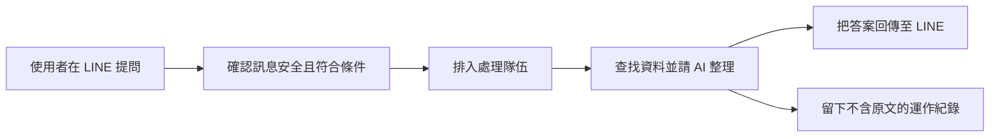

# AI-ChotBot 專案進度簡報

## 第 1 頁｜讓 LINE 成為即時、可靠的智慧服務入口

- 專案名稱：AI-ChotBot
- 一句話介紹：在 LINE 提問，就能取得經整理的實用答案
- 本次說明：成果、現況、風險與下一步

**講者備註：** 今天用約十五至二十分鐘，帶各位從使用者需求出發，了解 AI-ChotBot 已完成的能力、仍在開發的知識搜尋，以及正式上線前必須完成的驗證。

---

## 第 2 頁｜客戶目前面臨的問題

- 資訊分散，使用者不知道該去哪裡找
- 人工回覆速度與品質容易受忙碌程度影響
- 一般搜尋結果太多，判讀仍需花時間
- 服務若離開 LINE，使用門檻就會提高

**講者備註：** 使用者真正需要的不是更多連結，而是能在熟悉的 LINE 對話中快速獲得重點。對服務團隊而言，也需要降低重複回答的負擔，同時維持一致品質。

---

## 第 3 頁｜我們提供的解決方案

- 以 LINE 作為入口，不必另外安裝新工具
- AI 將問題與資料整理成容易閱讀的回答
- 天氣等即時資訊可連接外部可信服務
- 背景處理與安全檢查兼顧速度與穩定性

**講者備註：** 這套方案像一位設在 LINE 裡的智慧服務人員：先確認問題可安全處理，再查找適合的資料並整理重點，最後把答案送回原本的對話。

---

## 第 4 頁｜使用者實際操作情境

- 使用者在 LINE 輸入問題
- 系統回覆天氣、一般知識或服務資訊
- 複雜問題在背景處理，不占住接待入口
- 使用者直接在原對話收到整理後答案

**講者備註：** 例如使用者詢問週末天氣，系統會取得即時資料後用白話回覆；遇到需要較多查找的問題，系統會排隊處理，完成後仍在同一個 LINE 對話送達。

---

## 第 5 頁｜系統如何運作

- 先做安全與條件檢查，再接受處理
- 排隊機制像取號碼牌，避免尖峰時塞車
- 回傳答案，同時只留下去識別化運作紀錄

**講者備註：** 整體流程就像有秩序的服務櫃台：入口先確認來件，處理隊伍分散尖峰壓力，後台查資料並整理，再把結果送回；紀錄只用於掌握健康狀況。

---

## 第 6 頁｜已完成的核心功能

- LINE 訊息接收、判斷與回覆流程
- 背景排隊處理，降低尖峰流量影響
- AI 回答與即時天氣資料整合
- 隱私友善的運作觀測與錯誤追蹤
- 自動化測試、型別檢查與部署工具鏈

**講者備註：** 正式主分支已具備從收訊、排隊、AI 整理到回覆的完整骨架，也完成天氣整合、隱私保護的監測方式與自動化品質檢查，核心服務已可持續驗證。

---

## 第 7 頁｜AI 如何產生可靠回答

- 先辨識問題類型，再選擇合適資料來源
- 即時問題優先採用專門資料服務
- AI 負責整理與表達，不憑空取代來源
- 異常時採保守回覆，避免誤導使用者

**講者備註：** 可靠不代表 AI 永遠不會出錯，而是讓它在清楚邊界內工作。即時天氣由專門服務提供事實，AI 像編輯一樣整理；沒有足夠依據時則保守說明。

---

## 第 8 頁｜知識庫搜尋功能進度

- 狀態：開發中，尚未合併至正式主線
- 目標：先從專屬資料找答案，再交由 AI 摘要
- 目前仍需完成程式整理與逾時測試調整
- 通過自動化驗證後，才會進入合併與部署

**講者備註：** 知識搜尋像替 AI 增加一座專屬圖書館，能優先使用指定內容回答。不過這部分仍在開發分支，尚未成為主分支能力，也還不能視為正式可用。

---

## 第 9 頁｜使用技術與帶來的價值

- 每項技術都有明確角色，不為技術而技術
- 雲端元件像分工團隊，各自處理專長工作
- 開發與測試工具降低改版時的人工作業風險

| 技術 | 白話角色 | 帶來的價值 |
| --- | --- | --- |
| LINE Messaging API | LINE 與系統之間的收發櫃台 | 讓使用者留在熟悉的 LINE 完成提問與收答 |
| Cloudflare Workers | 就近服務使用者的雲端接待員 | 快速接收請求，且不必自建伺服器 |
| Queues | 尖峰時的取號碼牌系統 | 分散瞬間流量，降低漏單與塞車風險 |
| Workers AI | 雲端 AI 工作站 | 協助理解、整理並產生自然語言回答 |
| D1 | 結構化電子資料櫃 | 保存需要查詢與管理的結構化資料 |
| R2 | 大型檔案倉庫 | 經濟地存放文件與知識來源檔案 |
| Vectorize | 依語意找資料的智慧索引 | 找出意思相近的內容，不只比對關鍵字 |
| Open-Meteo | 即時氣象資料站 | 提供可查證的天氣資訊 |
| Tavily | 專為 AI 準備的網路搜尋助手 | 協助取得較新、可整理的外部資訊 |
| Hono | 輕量的網路服務骨架 | 讓接收與回覆流程清楚、容易維護 |
| TypeScript | 會先檢查格式的工程圖 | 提早發現資料與程式介面不一致 |
| Vitest | 自動巡檢員 | 重複驗證既有功能沒有被改壞 |
| Wrangler | 雲端環境的部署遙控器 | 統一開發、設定、測試與發布流程 |

**講者備註：** 這些名稱看似繁多，其實是把收訊、排隊、儲存、搜尋、AI 與測試分工。採用各司其職的元件，有助於提升速度、維護性，也能逐步擴充能力。

---

## 第 10 頁｜資料安全與隱私保護

- 入口先驗證訊息來源與必要條件
- 運作紀錄不保留使用者提問原文
- 敏感設定與程式、簡報內容分離
- 僅蒐集維運所需的最少資訊
- 正式環境仍需再次核對權限與設定

**講者備註：** 我們採取資料最少化原則：系統只留下判斷穩定性所需的事件與狀態，不在運作紀錄保存提問原文；憑證及識別資訊也不會放進程式碼或文件。

---

## 第 11 頁｜系統穩定性與測試成果

- 636 項指定測試全部通過
- TypeScript 型別檢查通過
- 完整預設測試曾有一項知識搜尋 E2E 失敗
- 原因：該端到端測試執行超過五秒
- 結論：核心成果穩定，分支逾時問題仍須處理

**講者備註：** 目前已有六百三十六項指定測試與型別檢查通過，提供良好信心；同時我們不隱藏例外，完整預設測試曾因知識搜尋端到端流程超過五秒而失敗。

---

## 第 12 頁｜現階段完成度

- 已完成：主分支核心訊息、排隊、AI、天氣與觀測能力
- 開發中：知識庫搜尋與相關端到端測試
- 待正式環境驗證：部署、設定、外部連線與實機回覆
- 進度以可驗證狀態呈現，不使用推估百分比

**講者備註：** 我們用三種狀態取代容易造成誤解的百分比。主分支核心能力已有測試證據；知識搜尋仍在分支；只有完成正式部署與實機驗收後，才能確認整體上線。

---

## 第 13 頁｜待完成工作與風險

- 知識搜尋仍有未提交修改，需整理並完成審查
- 知識搜尋 E2E 超過五秒，需調整流程或 timeout
- 正式部署與 smoke test 尚未執行
- 部分文件有中文亂碼，需修正並確認編碼
- `deploy-copy/` 為待清理的部署副本，避免版本混淆

**講者備註：** 現階段風險都已有明確處置方向：先收斂知識搜尋修改與逾時測試，再處理文件編碼及部署副本，最後用正式部署與冒煙測試確認關鍵流程。

---

## 第 14 頁｜下一階段規劃與總結

- 1. 完成分支：收斂知識搜尋、文件與清理工作
- 2. 自動化驗證：通過完整測試與型別檢查
- 3. 合併：審查後納入正式主線
- 4. 正式部署：發布設定完整的版本
- 5. 實機驗收：用 LINE 完成端到端確認

**講者備註：** 下一階段會依「完成分支、自動化驗證、合併、正式部署、實機驗收」推進。每一步都有可查驗結果，避免把開發完成誤認為上線完成，穩健交付給使用者。
